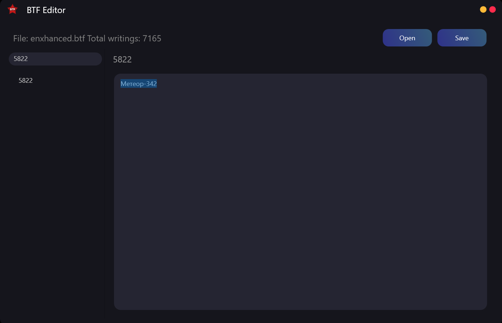

# BTF Editor

A simple editor for .btf files that are used to store textual data in Workers & Resources: Soviet Republic.

### How to use
+ Open BtfEditor.exe
+ Select the desired file with the Open button
+ Wait for the file to open
+ Select the string identifier you need in the list on the left or find it in the search
+ Change the string in the input field
+ After saving the file using the Save button

_I recommend not to delete the original .btf file._